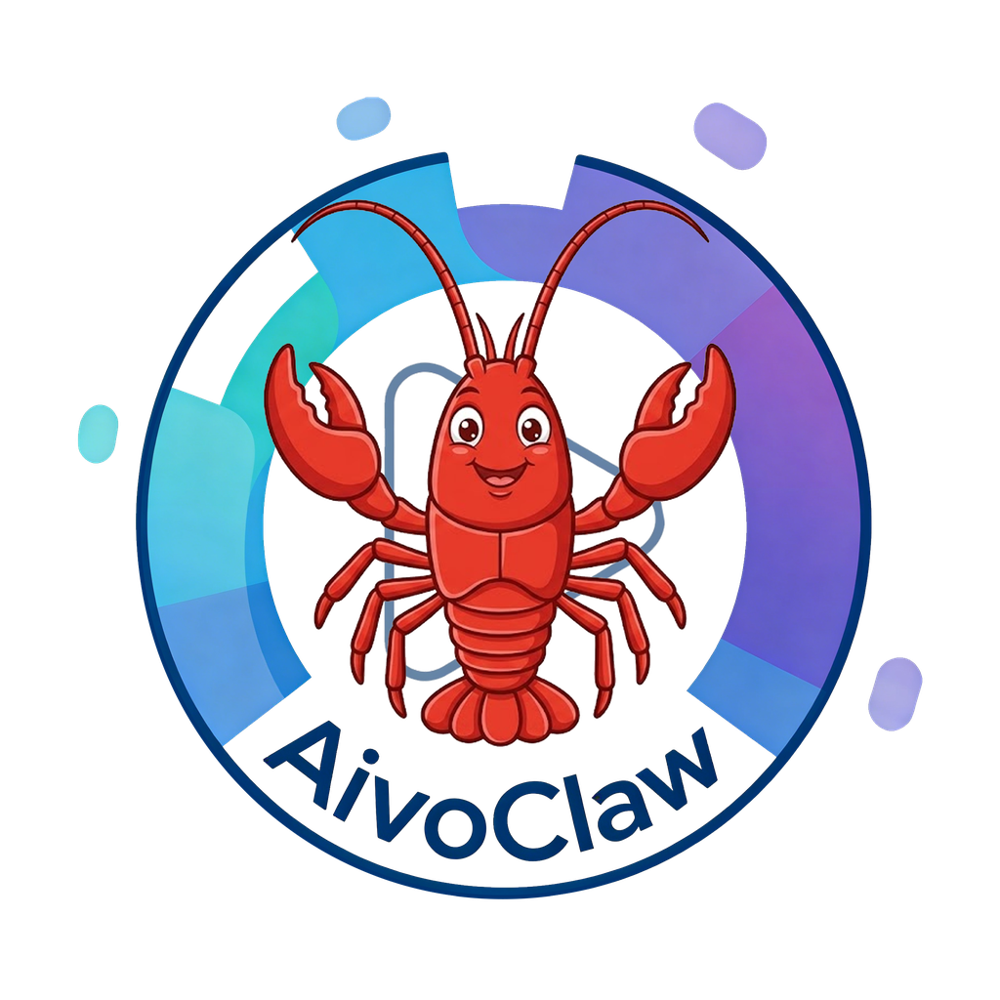

<p align="center">
  
</p>

<h1 align="center">AIVO Skills — AIVO Skills Collection</h1>

<p align="center">
  OpenClaw AI Agent skills for calling AIVO's complete video processing capabilities.
</p>

<p align="center">
  <a href="https://aivoclaw.com"></a>
  <a href="https://github.com/yuanyuekejiJN/AivoSkills"></a>
  <a href="https://github.com/yuanyuekejiJN/AivoSkills/blob/main/LICENSE"></a>
</p>

<p align="center">
  <a href="https://aivoclaw.com">🌍 Website</a> | <a href="./README.md">中文</a> | English
</p>

---

## Included Skills

| Skill | Description | Category |
|-------|-------------|----------|
| [aivo-luban](aivo-luban/) | Luban Mode — ZGL batch video editing | editing |
| [aivo-nezha](aivo-nezha/) | Nezha Mode — SWK multi-track matrix editing | editing |
| [aivo-fast-filter](aivo-fast-filter/) | Fast Filter — Auto remove silent segments | editing |
| [aivo-split-scene](aivo-split-scene/) | Split Scene — Detect scene transitions | editing |
| [aivo-tts](aivo-tts/) | AI Voice — Text-to-speech synthesis | audio |
| [aivo-video-download](aivo-video-download/) | Video Download — Multi-platform extraction | download |
| [aivo-download-split](aivo-download-split/) | Download + Split Scene — Combined skill | download |
| [aivo-download-extract](aivo-download-extract/) | Download + Transcript — ASR speech recognition | download |
| [aivo-copywriting-fission](aivo-copywriting-fission/) | Copywriting Fission — AI multi-version rewriting | copywriting |

## Prerequisites

- **AIVO Client**: Requires AIVO client to be running (port 7073)

## Installation

Copy skill directories to `~/.openclaw/skills/`:

```bash
# Install a single skill
cp -r aivo-luban ~/.openclaw/skills/

# Or install all skills
cp -r aivo-* ~/.openclaw/skills/
```

## Documentation Structure

Each skill contains:
- `manifest.json` — Skill metadata (version, dependencies, category)
- `SKILL.md` — AI usage guide (API paths, parameters, examples)

## Community

Join our community to get updates, ask questions, and share feedback:

<p align="center">
  
</p>

---

## ⭐ Star History

<a href="https://www.star-history.com/?repos=yuanyuekejiJN%2FAivoSkills&type=date&legend=top-left">
 <picture>
   <source media="(prefers-color-scheme: dark)" srcset="https://api.star-history.com/image?repos=yuanyuekejiJN/AivoSkills&type=date&theme=dark&legend=top-left" />
   <source media="(prefers-color-scheme: light)" srcset="https://api.star-history.com/image?repos=yuanyuekejiJN/AivoSkills&type=date&legend=top-left" />
   
 </picture>
</a>

## License

MIT License

---

<p align="center">
  <sub>Powered by <a href="https://aivoclaw.com">Yuanyue Technology</a></sub>
</p>